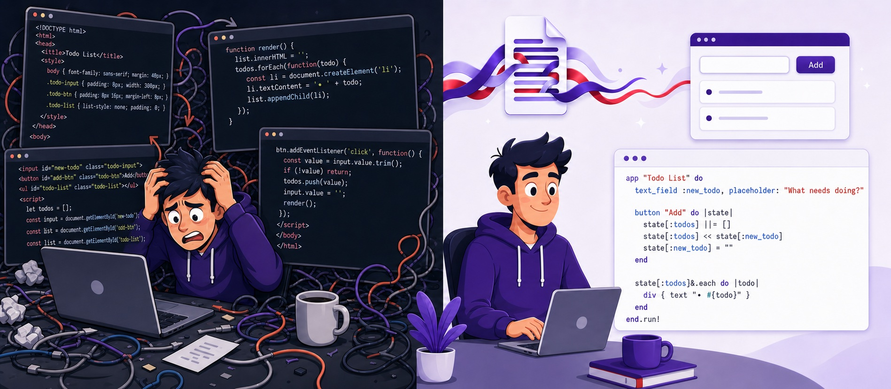

# StreamWeaver



**Express intention, get interface. The joy of Ruby applied to UI.**

```ruby
app "Meeting Notes" do
  header "1:1 with #{manager}"
  md notes
end.run!
```

That's it. No HTML. No CSS. No JavaScript. No webpack.

---

## Platform support

| Tier | Platforms | What you get |
|---|---|---|
| Tested & supported | macOS + iTerm2 + Chrome + gh | The full `get-started` course: a controller canvas window, an agent worker tab, live demo panes, one-click sharing |
| Expected to work, untested | macOS plain terminal, Linux, WSL | The degraded path: `canvas-read` plus a browser-tab canvas, no panel/worker automation |
| Known degraded path | Any of the above | `streamweaver get-started --degraded` |
| Future | Windows native, other terminals/multiplexers | Not yet built |

A few things worth being explicit about:

- `streamweaver panel` and the worker-tab automation it drives are **macOS + iTerm2 only** — they script iTerm2's Python API.
- `canvas-read` is a plain local web server. It's the most portable piece of StreamWeaver and doesn't need iTerm2, Chrome, or `gh` — see [docs/canvas-read.md](docs/canvas-read.md).
- The Chrome extension and the `gh` CLI are enhancers for *sharing* docs (Gist links that render nicely), not requirements for reading them locally.
- Never assume a port. Every command that starts a server prints the URL it actually bound — StreamWeaver auto-increments past busy ports.

---

## Why StreamWeaver?

**TL;DR:** I want a quick UI. What do I need? Some text, a few inputs, a button. Why isn't *that* the interface? Instead: HTML, CSS, JavaScript, backend wiring... Streamlit showed me the interface *can* just be "text, inputs, button." StreamWeaver brings that to Ruby - and it turns out this minimal approach is perfect for AI agents too.

[Skip to Quick Start →](#quick-start)

<details>
<summary><b>The Longer Story</b></summary>

### The Interface Should Be What You Need

Think about what a simple UI actually requires: some text, a few inputs, maybe a dropdown, a button. That's it. That's what you're trying to build. But to get there you're dealing with HTML structure, CSS styling, JavaScript (or a backend framework), controllers, state management...

Streamlit's brilliance was recognizing that the DSL *can* just be the interface. You describe what you need - text, inputs, button - and you're done. StreamWeaver brings that philosophy to Ruby.

### Why This Matters for AI Agents

When you're building with Claude Code (or other AI coding assistants), this "what matters" approach pays off even more:

1. **Token efficiency** - The LLM generates a concise DSL instead of verbose HTML/React. **5-10x fewer tokens** means faster responses and lower costs.

2. **Rich interactions** - Instead of walls of terminal text for complex decisions, spin up an actual UI. What would be 5 pages of back-and-forth becomes one well-designed form.

3. **Persistent output** - Claude generates content (meeting notes, analysis, reports) but terminal output scrolls away. Canvas mode gives Claude a persistent display that stays visible.

4. **Data-only generation** - Pre-build your StreamWeaver app once, then have the LLM just generate the *data* to feed it. Minimal tokens, maximum speed.

```ruby
# Agent generates just this data:
meetings = [{ title: "1:1 with Sarah", notes: "..." }, ...]

# Pre-built app renders it:
MeetingNotesApp.new(meetings: meetings).run!
```

</details>

---

## vs. "I can show you a mockup, but it's token-intensive"

Ask Claude for a visual and you'll often get something like this:

> Some of what we're working on might be easier to explain if I can show it to you in a web browser. I can put together mockups, layout comparisons, and other visuals as we go. This feature is still new and can be token-intensive. Want to try it? (Requires opening a local URL)

That's an honest warning, not a bug - hand-written HTML/React artifacts *are* token-intensive, so tools built that way have to gate visual explanation behind an expensive, novel, opt-in mode. TypeScript-flavored tooling doesn't have Ruby's sensibilities about generating a lot of interface from a little code.

StreamWeaver's answer: mockups, layout comparisons, and diagrams aren't a special mode you opt into - they're the default, at 5-10x fewer tokens than hand-written markup (see below), and they're **two-way interactive** while a static artifact isn't. Same local-browser mechanism, none of the token tax.

---

## The Modes

StreamWeaver evolved through real needs, resulting in four modes:

| Mode | Command | What It Does | Use Case |
|------|---------|--------------|----------|
| **Standalone** | `ruby app.rb` | Auto-port, auto-browser, persistent server | Quick apps, utilities, prototypes |
| **Agentic** | `app.run_once!` | Popup UI → collect input → return JSON → quit | Claude Code needs structured input |
| **Canvas** | `streamweaver live SESSION` | Persistent display that Claude updates | Output that doesn't scroll away |
| **Service** | `streamweaver app.rb` | Single server, multiple apps | Development, showcase, tutorial |

### `ruby app.rb` vs `streamweaver app.rb`

| Command | Process Model | When to Use |
|---------|---------------|-------------|
| `ruby app.rb` | You own the process, runs until you kill it | Quick one-off scripts, standalone apps |
| `streamweaver app.rb` | Managed by background service, multi-app routing | Multiple apps side-by-side, development |

The service mode runs one Sinatra server for all apps instead of one process per app.

### From Local Script to Mobile Dashboard

StreamWeaver apps cover a wide range — the same DSL works whether you're hacking a quick one-off or running a persistent dashboard you check from your phone:

| Scenario | Host | Port | How |
|----------|------|------|-----|
| **Quick one-off** | localhost | auto-detect | `ruby app.rb` — browser opens, use it, Ctrl+C |
| **Agentic popup** | localhost | auto-detect | `app.run_once!` — collect input, return JSON, exit |
| **Puma-dev** | localhost | from Puma-dev | `config.ru` + `puma-dev link` — access at `http://myapp.test` |
| **Mobile/Tailscale** | `0.0.0.0` | fixed | `STREAMWEAVER_HOST=0.0.0.0 STREAMWEAVER_PORT=4580 ruby app.rb` |
| **LAN access** | `0.0.0.0` | fixed | Same — any device on your network can reach it |
| **Always-on dashboard** | `0.0.0.0` | fixed | Bookmark `http://your-machine:4580` on your phone |

**Environment variables** (overridden by code options if set):
- `STREAMWEAVER_HOST` — bind address (default: `127.0.0.1`)
- `STREAMWEAVER_PORT` — fixed port (default: auto-detect from 4567)
- `PORT` — standard port variable (used by Puma-dev, Heroku, etc.)

For quick local work, the defaults are perfect — auto-find a port, open the browser, done. For mobile or remote access (Tailscale, LAN), set a fixed host and port so your URL stays stable across restarts. For Puma-dev, see [examples/puma_dev](examples/puma_dev).

---

## Quick Start

Three steps to awesome:

```bash
gem install stream_weaver
streamweaver install
streamweaver get-started
```

`install` wires StreamWeaver into Claude Code (permissions + skills); `get-started` walks you
through a short interactive course, next to your own terminal. On macOS + iTerm2 you get the full
experience; anywhere else it falls back to a browser tab automatically (or jump straight there with
`streamweaver get-started --degraded`). See [Platform support](#platform-support) above.

Prefer to explore on your own first?

```bash
# Interactive tutorial
streamweaver tutorial

# Browse examples
streamweaver showcase

# Run any example
ruby examples/basic/hello_world.rb
```

---

## Standalone Mode

The simplest path - one Ruby file, one command:

```ruby
# todo.rb
require 'stream_weaver'

app "Todo List" do
  text_field :new_todo, placeholder: "What needs doing?"

  button "Add" do |state|
    state[:todos] ||= []
    state[:todos] << state[:new_todo]
    state[:new_todo] = ""
  end

  state[:todos]&.each do |todo|
    div { text "• #{todo}" }
  end
end.run!
```

```bash
ruby todo.rb
# Browser opens at http://localhost:4567
```

---

## Puma-dev Mode

Run StreamWeaver apps with [Puma-dev](https://github.com/puma/puma-dev) for memorable local URLs like `http://myapp.test` that are always available without manually starting the server:

```ruby
# config.ru
require 'bundler/setup'
require 'stream_weaver'

App = app "My App" do
  header1 "Hello from Puma-dev!"
  text_field :name, placeholder: "Your name"
end

run App
```

```bash
# Link to Puma-dev
puma-dev link

# Access at http://[directory-name].test
# Browser won't auto-open - perfect for on-demand access
```

**Key differences from standalone mode:**
- Uses the `PORT` environment variable set by Puma-dev
- Browser doesn't auto-open (you access the URL when you need it)
- App starts automatically on first request

See [examples/puma_dev](examples/puma_dev) for a complete example.

---

## Agentic Mode

When Claude Code needs structured input, not terminal menus:

```ruby
result = app "Project Setup" do
  header "Configure New Project"
  text_field :name, placeholder: "Project name"
  select :database, ["PostgreSQL", "SQLite", "MySQL"]
  checkbox :docker, "Include Docker setup"
end.run_once!

# Browser opens, user fills form, returns:
# { "name" => "myapp", "database" => "PostgreSQL", "docker" => true }
```

The browser opens, user fills the form, JSON returns to the calling script. Perfect for AI workflows that need human input.

---

## Canvas Mode

A persistent browser display that Claude Code can update. Content stays visible instead of scrolling away in the terminal.

```bash
# Start the canvas (keeps running)
streamweaver live mynotes

# Claude Code pushes content as it works
streamweaver push mynotes --dsl 'md "# Analysis Results\n\n## Key Findings\n- ..."'

# Canvas updates in real-time
```

**Pro tip:** iTerm2 has a [built-in browser](https://iterm2.com/documentation-web.html) that fits into split panes - run Claude Code on the left, canvas on the right, same window.

### Saving & Sharing Docs

A canvas session's "Save as doc" button writes it to disk in two possible
formats:

- **`.rb`** — the DSL source, canonical. Always lossless.
- **`.org`** — a human-readable, roundtrippable export (`streamweaver
  org-export <file.rb>` / `org-render <file.org>` from the CLI, or the
  Save-as-Org button in the UI). `:doc`-vocabulary content (`doc_header`,
  `callout`, `card`, `table`, etc.) round-trips cleanly and reads like a real
  document in GitHub's own file view or any generic org-mode viewer, with no
  StreamWeaver tooling required. Content outside that vocabulary still
  round-trips (a verbatim-recovered raw block), just without the readability
  payoff. Saving as org shows a coverage notice when a doc isn't a good fit
  for the format — never blocks the save.

Where a doc saves is automatic today: repo-local
(`<repo>/docs/streamweaver_canvas/`) if you're inside a git repo, `~/.streamweaver/canvas`
otherwise — no way to choose yet. An explicit "global vs. this repo" toggle
is designed but not built (`docs/plans/canvas-doc-location-and-discovery.md`);
expect this UX to change.

Saved `.rb`/`.org` docs checked into a GitHub repo render with full
StreamWeaver styling via the [browser extension](extension/README.md) — see
below.

### Templates for Common Patterns

```bash
# Quick selection
streamweaver template choices mysession '{"title": "Pick DB", "options": ["PostgreSQL", "SQLite"]}'
# Returns: {"choice": "PostgreSQL"}

# Yes/No confirmation
streamweaver template confirm mysession '{"title": "Delete?", "message": "Cannot be undone"}'
# Returns: {"confirmed": true}

# Multi-step wizard
streamweaver template wizard mysession '{"steps": [...]}'

# Data table with selection
streamweaver template table mysession '{"headers": ["File", "Size"], "rows": [...]}'
```

---

## Browser Extension

Push a `.rb` or `.org` doc to GitHub or a Gist, and even without this
extension it's still legible — `.org` already reads close to markdown there.
With this extension, either format renders exactly as designed: sidebar nav,
callouts, cards, tables, live Mermaid diagrams, all compiled and displayed
entirely inside the browser. No StreamWeaver install, no Ruby, no server, no
vendor lock-in — just a "View rendered" button next to the file. Works on
public and private repo blob pages, GitHub Gists (including multi-file
gists), and local files dropped straight into the viewer with no GitHub at
all.

That's the actual point of shipping this publicly: docs like this only get to
move freely between a work team and outside collaborators once anyone with a
browser can open one.

### Install

**[Chrome Web Store](https://chromewebstore.google.com/detail/streamweaver-doc-viewer/odjjednfpfiagefgpcfdlelldphmpcgj)**
— the primary path. One click, no build step, works right away.

**Dev path** — building from source, for contributors working on the
extension itself:

```bash
bin/vendor_browser_assets   # once
bin/build_extension
```

Then `chrome://extensions` → Developer mode → Load unpacked → select
`extension/`. See [`extension/README.md`](extension/README.md) for how it
works, the full architecture, and current known gaps.

### Share a doc

Two ways to hand someone a doc, depending on how much staying power it needs:

- **Quick collab** — push the doc to a Gist, then send the Gist link plus
  the [extension link](https://chromewebstore.google.com/detail/streamweaver-doc-viewer/odjjednfpfiagefgpcfdlelldphmpcgj).
  No install for you, one click for them: after installing, they open the
  Gist link and a **View rendered** button appears in that file's header
  bar, next to its Raw/Copy buttons — click it. (If the Gist tab was
  already open before installing, refresh the page first; a newly
  installed extension only runs in tabs loaded after install.) Good for a
  one-off review or looping in someone outside the team.
- **Level up** — commit the same `.org` file to the team repo. It renders
  identically in the repo's own file view, no format change required. The
  doc graduates from shared-once to living with the code it documents.

---

## Components

### Text & Headers

```ruby
text "Plain text"
md "**Markdown** with *formatting* and [links](url)"
header "Section"       # <h2> default
header1 "Page Title"   # through header6
```

### Form Inputs

```ruby
text_field :name, placeholder: "Name", default: "Alice"
text_area :bio, rows: 5
select :color, ["Red", "Green", "Blue"], default: "Green"
checkbox :agree, "I accept"
radio_group :size, ["S", "M", "L"]
```

### Buttons

```ruby
button "Primary" do |state|
  state[:clicked] = true
end

button "Secondary", style: :secondary do |state|
  # ...
end
```

### Scoped Fragments

Fragments keep the normal single full DSL rerun while limiting the HTML swapped into
the page. Interactive controls target their enclosing fragment automatically.

```ruby
action :refresh, updates: :sidebar_count do |state, account_id|
  state[:account_id] = account_id
end

fragment :results do
  text "Account: #{state[:account_id]}"
  button "Refresh", action: :refresh, key: 42
end

fragment :sidebar_count do
  text "Selected: #{state[:account_id] ? 1 : 0}"
end
```

Use `updates:` on an action or button to refresh additional named fragments with
out-of-band swaps. Server-rendered content in other fragments is intentionally left
unchanged; omit fragments when an interaction must refresh the whole app. If a target
disappears or routing changes, StreamWeaver automatically falls back to a full swap.

### Layout

```ruby
columns widths: ['30%', '70%'] do
  column { text "Sidebar" }
  column { text "Main" }
end

vstack spacing: :md do
  text "Item 1"
  text "Item 2"
end

hstack justify: :between do
  button "Cancel", style: :secondary
  button "Save"
end

card do
  header3 "Title"
  text "Content"
end

collapsible "Show Details" do
  text "Hidden until clicked"
end
```

### Tables

```ruby
# Simple
table headers: ["Name", "Age"], rows: [["Alice", 30], ["Bob", 25]]

# From hashes (headers inferred)
table [{ name: "Alice", age: 30 }, { name: "Bob", age: 25 }]

# With formatters
table users do
  column :name
  column :balance, format: :currency
  column :joined, format: :date
end

# Interactive
table data, sortable: true, sticky_header: true, striped: true, markdown: true
```

### Charts

```ruby
bar_chart data: { sales: 100, costs: 60, profit: 40 }
line_chart data: [12, 19, 8, 15, 22], fill: true
pie_chart data: { frontend: 40, backend: 35, devops: 25 }
sparkline data: [45, 52, 48, 61, 55, 67, 72]
```

### Navigation & Modals

```ruby
tabs :settings do
  tab("General") { text_field :name }
  tab("Advanced") { checkbox :debug, "Debug" }
end

modal :confirm, title: "Are you sure?" do
  text "This cannot be undone."
  modal_footer do
    button "Cancel", style: :secondary do |s| s[:confirm_open] = false end
    button "Delete" do |s| do_delete; s[:confirm_open] = false end
  end
end
```

### URL Routing

Deep links, bookmarkable URLs, and browser back/forward — no router library, just a
bidirectional map between a URL path and a slice of state:

```ruby
route_with(
  parser:  ->(path) { path == '/goals' ? { main_nav: 2 } : nil },
  builder: ->(state) { state[:main_nav] == 2 ? '/goals' : nil }
)
```

`route_by` covers the simple single-key case. See [`docs/routing.md`](docs/routing.md) for the
full contract — including a **Common Pitfalls** section worth reading before an app grows past a
handful of routes (state merges rather than replaces on every GET, so an incomplete route table
fails silently rather than loudly).

### Feedback

```ruby
alert(variant: :success) { text "Saved!" }
progress_bar value: 75, variant: :success
spinner label: "Loading..."
toast_container position: :top_right
```

### Dashboard Components

For operations dashboards (best with `theme: :dark`):

```ruby
status_dot status: :green, pulse: true
badge "5", variant: :danger
stat_display value: 42, label: "TASKS"
priority_item priority: :critical, title: "Server down"

app_shell sidebar_width: "320px" do
  main { header "Dashboard" }
  sidebar(header: "Alerts") { priority_item priority: :high, title: "CPU 90%" }
end
```

---

## Theming

```ruby
app "My App", theme: :dark do
  # Dark mode with glow effects
end

app "Report", theme: :document do
  # Reading-optimized (serif, paper background)
end
```

**Built-in themes:** `:default`, `:dashboard`, `:document`, `:dark`

---

## More Resources

- [Canvas Mode Documentation](docs/canvas-roadmap.md)
- [canvas-read: the document shelf](docs/canvas-read.md) — the most portable way to read StreamWeaver docs, no iTerm2 required
- [Templates Reference](docs/templates.md)
- [Components Reference](docs/components_reference.md)
- [Service Mode](docs/SERVICE_MODE.md)
- [URL Routing](docs/routing.md) — `route_by`/`route_with`, plus Common Pitfalls for larger apps

---

## Contributing

Contributions welcome! [GitHub repository](https://github.com/fkchang/stream_weaver)

## License

MIT License - see [LICENSE.txt](LICENSE.txt)
